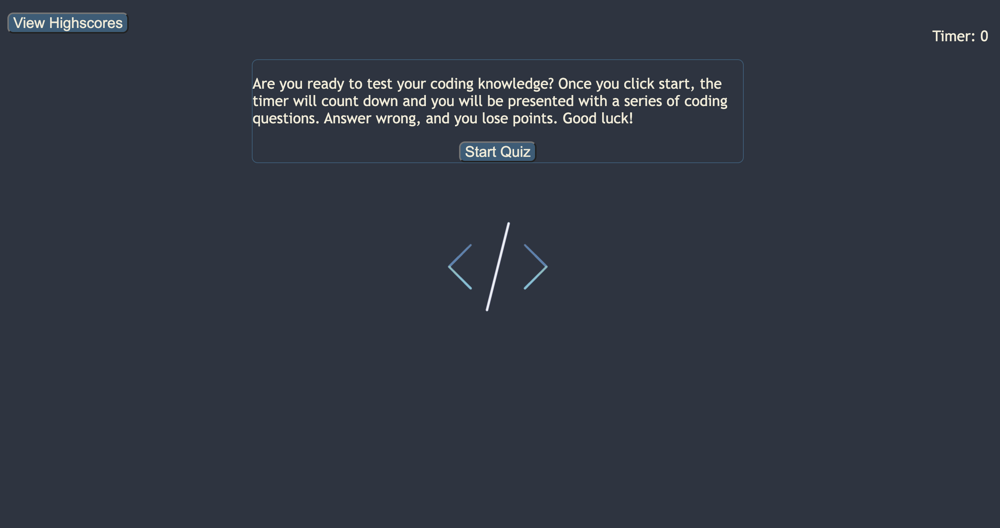

# Coding Quiz
A timed coding quiz with multiple choice questions, quiz starts when you click start quiz and you are presented with multiple choice questions that have to be answered correctly in order to get a high score.

## Languages and Tools Used

* 
* 
* 
* 

## Usage

[Deployed Live Site](https://teedaa.github.io/coding-quiz)

## Credits 
Pengteda Cheng
[Github](github.com./teedaa)
[LinkedIn](linkedin.com/in/pengteda-cheng)
[Markdown Badges](https://github.com/Ileriayo/markdown-badges)
